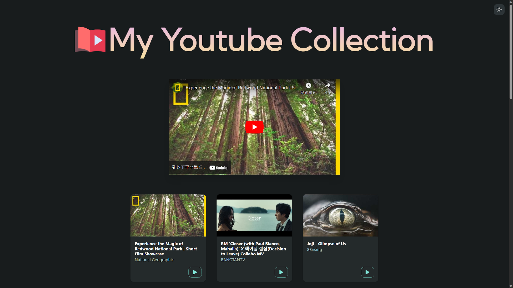
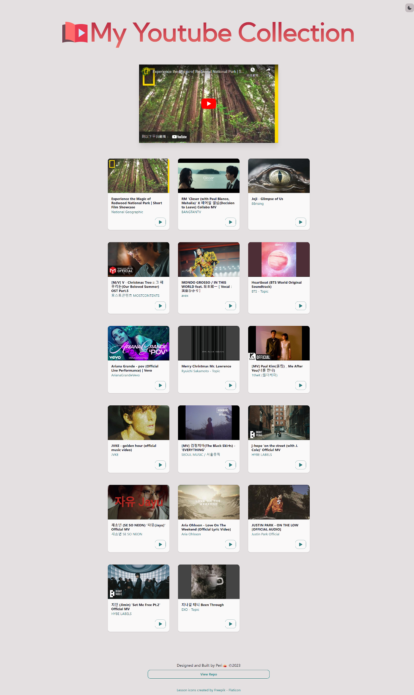
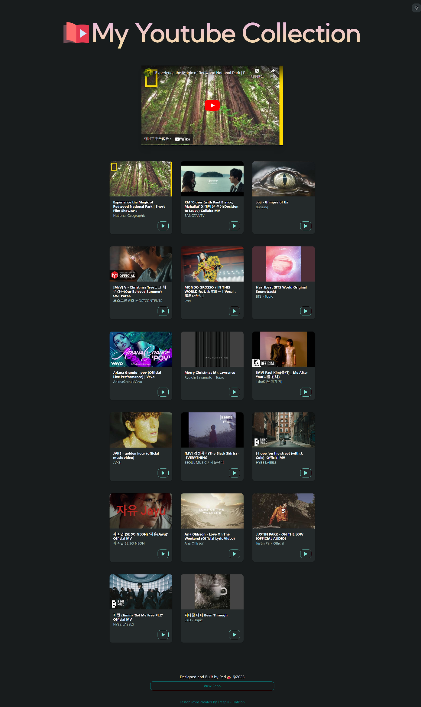

# My Youtube Collection🎬🎵

- The Next.js web application showcasing video information cards retrieved from my youtube playlist
- A video player allows user to click and play video
- Support toggling Dark Mode

# Demo

My Youtube Collection is deploying via Vercel, welcome to visit: https://youtube-playlist-next-app.vercel.app/

# Tech

- Learn TypeScript with Next.js React app
- Use Chakra UI as React component library
- Use static site generation (SSG) to fetch Youtube Data API
- Use IFrame Player API to embed a video player
